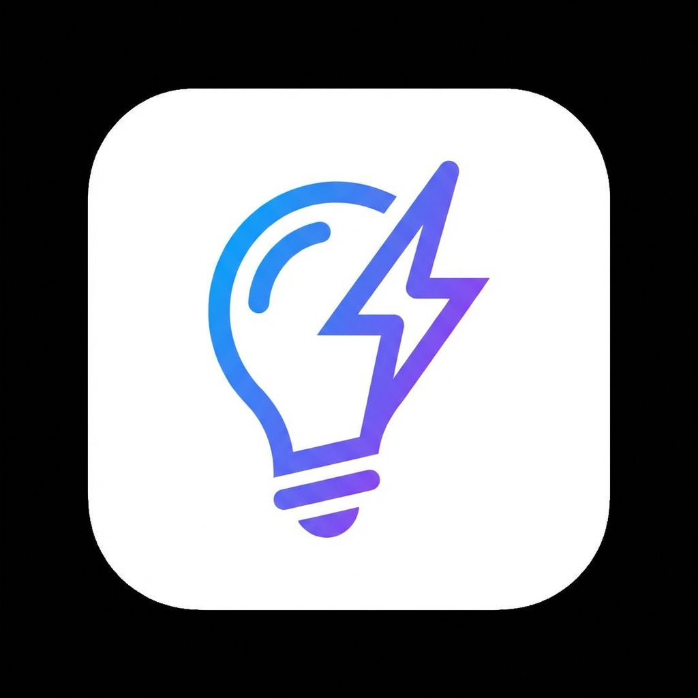

<div align="center">
  
  <h1>Promptly</h1>
  <h3>Turn vague ideas into powerful prompts with one click.</h3>

  <p>
    <a href="https://github.com/praneethreddie/promptly-extension-/blob/main/LICENSE">
      
    </a>
    <a href="https://github.com/praneethreddie/promptly-extension-/issues">
      
    </a>
    <a href="https://github.com/praneethreddie/promptly-extension-/stargazers">
      
    </a>
    <br />
    <a href="#features">Features</a> •
    <a href="#installation">Installation</a> •
    <a href="#configuration">Configuration</a> •
    <a href="#usage">Usage</a> •
    <a href="#development">Development</a>
  </p>
</div>

---

## 🚀 About The Project

**Promptly** is your AI-powered companion for prompting. It seamlessly integrates into **ChatGPT**, **Claude**, and **Gemini**, allowing you to transform simple, one-line requests into highly structured, context-rich prompts that unlock the full potential of Large Language Models (LLMs).

Stop wasting time iterating on "meh" outputs. Get it right the first time.

## ✨ Features

-   **⚡ Seamless Integration**: Adds a native-feeling "Optimize" button directly inside the chat input box.
-   **🤖 Multi-LLM Support**: Works out of the box with:
    -   **Google Gemini**
    -   **Anthropic Claude**
    -   **OpenAI (ChatGPT)**
    -   **Custom API Endpoints**
-   **🔒 Privacy First**: Your API keys are stored extensively in your *local browser storage*. No intermediate servers. No data logging.
-   **🛠 Highly Configurable**: Choose which AI model optimizes your prompts. Use your own keys or the included free tier (via OpenRouter).
-   **🎨 Intelligent UI**: Animated feedback, tooltips, and non-intrusive design that respects the host site's aesthetics.

## 📦 Installation

Since Promptly is currently in **Developer Preview**, you can install it manually in less than a minute.

1.  **Clone the Repository**
    ```sh
    git clone https://github.com/praneethreddie/promptly-extension-.git
    ```
    *Or download the [ZIP file](https://github.com/praneethreddie/promptly-extension-/archive/refs/heads/main.zip) and extract it.*

2.  **Open Chrome Extensions**
    -   Navigate to `chrome://extensions/` in your address bar.

3.  **Enable Developer Mode**
    -   Toggle the switch in the top-right corner to **ON**.

4.  **Load Unpacked Extension**
    -   Click the **"Load unpacked"** button (top-left).
    -   Select the folder where you cloned/extracted the project.

🎉 **Success!** You should now see the Promptly icon in your browser toolbar.

## ⚙️ Configuration

Before creating magic, you need to tell Promptly which brain to use.

1.  Click the **Promptly (Puzzle Piece/Bulb)** icon in your browser toolbar.
2.  **Select Provider**: Choose your preferred AI backend (e.g., Gemini, Claude, OpenAI).
3.  **Enter API Key**:
    -   **Gemini**: [Get Key](https://aistudio.google.com/app/apikey)
    -   **Claude**: [Get Key](https://console.anthropic.com/)
    -   **OpenAI**: [Get Key](https://platform.openai.com/api-keys)
    -   *Default*: Uses a free tier via OpenRouter (no key needed, but rate limited).
4.  Click **"Save Settings"**.

> **Note**: Your keys are saved securely in `chrome.storage.local`.

## 🎮 Usage

1.  **Go to your favorite Chatbot**:
    -   [ChatGPT](https://chatgpt.com)
    -   [Claude.ai](https://claude.ai)
    -   [Google Gemini](https://gemini.google.com)

2.  **Type a Draft**:
    > "Write a python script for snake game"

3.  **Click Optimize**:
    -   Click the small **Lightbulb Icon** 💡 located near the send button.
    -   *Wait a second...* ✨

4.  **Send**:
    -   Your simple text is instantly replaced with a professional, detailed prompt engineering masterpiece.
    -   Hit Enter and enjoy better results!

## 🔧 Development

Want to contribute? Great! Here is how to add a new AI provider.

### Project Structure
-   `manifest.json`: Extension configuration (Manifest V3).
-   `content.js`: Logic for ChatGPT.
-   `claude-content.js`: Logic for Claude.
-   `gemini-content.js`: Logic for Gemini.
-   `background.js`: Handles API requests (cors by-pass).
-   `popup.*`: The settings menu.

### Adding a Provider
1.  **Update UI**: Add option to `popup.html`.
2.  **Handle Key**: Update `popup.js` to save the new key.
3.  **Implement API Call**:
    -   Edit `background.js`.
    -   Add a new function `callNewProvider(apiKey, prompt)`.
    -   Add it to the switch case in `handleOptimizePrompt`.

## 🛡️ Privacy & Security

-   **No Analytics**: We do not track your usage.
-   **Local Storage**: API Keys are stored locally on your device.
-   **Direct Connections**: Requests go directly from your browser to the AI Provider (Google/Anthropic/OpenAI). We do not proxy your data.

## 🤝 Contributing

Contributions, issues, and feature requests are welcome!
Feel free to check the [issues page](https://github.com/praneethreddie/promptly-extension-/issues).

## 📄 License

Distributed under the MIT License. See `LICENSE` for more information.

---

<div align="center">
  <b>Built with ❤️ by <a href="https://github.com/praneethreddie">Praneeth Reddie</a></b>
</div>
